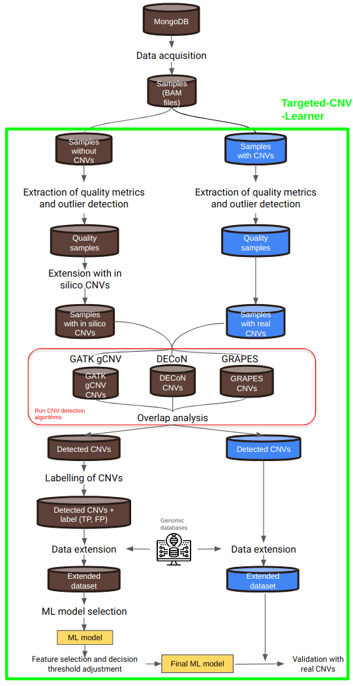

# Targeted-CNV-Learner

Here, it is introduced Targeted-CNV-Learner, an ad-
vanced machine learning framework designed to enhance the detection of Copy Number
Variations (CNVs) in targeted gene panels. CNVs play a critical role in various genetic disor-
ders, and their precise identification is vital for clinical diagnostics. However, current CNV
detection methods, especially those used in targeted sequencing, often suffer from high
false positive rates and limited precision, underscoring the need for more robust solutions.
The primary objective of this work was to address these challenges by proposing a novel
methodology that integrates the outputs of multiple CNV detection algorithms. Targeted-
CNV-Learner leverages the strengths of three widely used algorithms—GATK gCNV, GRAPES,
and DECoN—alongside genomic features to accurately differentiate between true CNVs and
artifacts. 

A comprehensive analytical pipeline was developed to automate the processes of sample
analysis, data labeling, and model training. This pipeline facilitated the systematic evalu-
ation and benchmarking of Targeted-CNV-Learner against individual CNV detection algo-
rithms. The results showed that Targeted-CNV-Learner outperformed the standalone meth-
ods, achieving the highest accuracy (95.5%) on the test set and a substantial reduction in
false positives compared to DECoN, GRAPES, and GATK gCNV. Moreover, the model main-
tained high sensitivity, effectively detecting CNVs while minimizing the need for unneces-
sary orthogonal validations when validated. These findings were further confirmed through
real CNV data, where Targeted-CNV-Learner matched the high sensitivity of GRAPES.

A comprehensive explanation on how Targeted-CNV-Learner works can be found in [the following pdf](/template/main.pdf)

In the following figure, an overview of the methodology used by Targeted-CNV-Learner can be observed:



## Requirements
Targeted-CNV-Learner requires at least 200 samples to build a reliable model. Therefore, it's crucial to have at least 200 samples (bam files) analyzed using the same gene panel to create a sufficiently large dataset for training the machine learning model.
## Installation

### Step 1: Clone the Repository
First, clone the repository:
```bash
git clone https://github.com/OriolCanal/Targeted-CNV-Learner.git
cd Targeted-CNV-Learner
```

### Step 2: Create a virtual environment: 
Next, create and activate a Python virtual environment:


```
python3 -m venv venv
source venv/bin/activate
```

### Step 3: Install dependencies:
Install the necessary dependencies listed in the requirements.txt file:


```
pip install -r requirements.txt
```

## Input structure preparation

### Step 4: Organize BAM Files by Run
Create a directory structure under the /bams/ directory, where each run of samples is stored in its own subdirectory.

For example, if you have samples RB2222, RB2223, RB2224, and RB2225 from run RUN20230505, follow these steps:

1. In the /bams/ directory, create a subdirectory named RUN20230505.
2. Place the corresponding BAM files for samples RB2222, RB2223, RB2224, and RB2225 in /bams/RUN20230505/.


### Step 5: Provide a list of previously identified CNVs
If any CNVs have already been identified and validated using an orthogonal technique, include them in a CSV file named real_CNV.csv. The file should follow this format:

LAB_ID,GENE,EXON,TYPE,chr,start,end<br>
RB19783,LDB3,ALL,DUP,10,81840174,88459131<br>
RB20322,MYH6,26-28,DUP,14,23861760,23888828<br>
RB20616,CTNNA3,11,DEL,10,68381352,88459131<br>


## Run Targeted-CNV-Learner

Targeted-CNV-Learner can be executed in three main steps, allowing users to create models, analyze results, and predict CNVs on new datasets. Each step involves specific commands and options, which are described below.

### Step1: Model creation ('create_model')
The create_model step automates all processes leading to the creation of CNV detection models using Random Forest and XGBoost algorithms. This step is computationally intensive, as it involves:

* Quality Control: Filtering samples based on a user-defined threshold.
* Simulating CNVs: Generating BAM files with in silico CNVs.
* Running CNV Detection: Applying CNV detection algorithms to the samples.
* Overlapping Analysis: Performing analysis on overlapping CNVs.
* Dataset Preparation: Extending the dataset to enable model creation.

The following optional parameters can be provided with the create_model command:

* --z_score_threshold: Specifies the Z-score threshold to identify outliers in quality control. A higher value relaxes quality control strictness (default: 2).

* --bed: Path to the .bed file corresponding to the gene panel for the analysis.

### Step 2: Model Analysis (Model.ipynb)

After model creation, results can be explored and analyzed using the Model.ipynb notebook. In this step, you can:

* Evaluate Model Metrics: Inspect the performance metrics of different models (e.g., precision, recall, F1-score).

* Feature Analysis: Analyze the influence of various features on the model's predictions.

* Model Selection: Select the best-performing model and adjust decision thresholds to suit your specific requirements.

### Step 3: Prediction ('predict')

The predict command is used to apply the trained model to a new dataset. This can involve predicting CNVs on a novel dataset or evaluating the model against a known dataset with real CNVs. The following parameters must be specified:

* --model_path: Path to the trained model file.
* --bed_file: Path to the .bed file corresponding to the gene panel.
* --z_score_threshold: Z-score threshold for quality control during prediction (default: 2).
* --run_path: Path to the folder containing the BAM files for the samples to be analyzed.


## Example commands:

1. Create model: 
```bash
python targeted_cnv_learner.py create_model --z_score_threshold 2.5 --bed /path/to/bedfile.bed
```
2. Analyze Model: Open Model.ipynb in Jupyter Notebook and run the cells in order to proceed with the analysis.

3. Predict CNVs:

```bash
python targeted_cnv_learner.py predict --model_path /path/to/model.pkl --bed_file /path/to/bedfile.bed --z_score_threshold 2 --run_path /path/to/run_folder/
```
